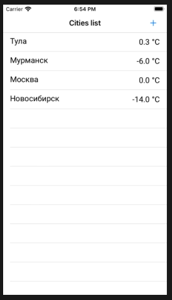
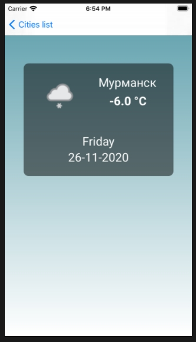

Погода и экран с подробностями
========================
#### Общее описание:
На основном экране выводится список дефолтных городов (название и температура). Реализована возможность добавления в список по имени города.  
При клике по строке появляется экран с деталями (иконка погоды, дата, день недели, температура).
    
#### Скриншоты:  

  
  

